Task management API


Conforme solicitado no [arquivo com descrição do desafio](https://github.com/romesdev/task-management-api/blob/main/Backend%20developer%20test.pdf), implementei uma API para gerenciamento de tarefas. 

## Tecnologias

- PHP 8.3
- Laravel 11
- MySQL 
- Eloquent ORM
- PHPunit (testes)
- Docker
- Laravel Pint (code style)
- Swagger
- GitHub Actions

<p align="center"><a href="https://laravel.com" target="_blank"></a></p>

Optei pelo Laravel por apresentar ser o framework mais consolidado do ecossistema PHP e pela minha experiência prévia também. Também cogitei utilizar o Symfony que também já utilizei. 

## Descrição geral

Para esse desafio procurei apresentar uma API com autenticação, registro de usuários, um CRUD completo de tarefas, listagem paginada, validações para as entradas do usuários (por exemplo, campos obrigatórios e formatação específica para os valores informados: data, status e email), regras de modificações nos recursos (como: deleção de uma tarefa só possível se feita pelo criador da tarefa, as demais ações são permitidas) e padronização de responses (configurados em Traits).

Usualmente, busco utilizar uma estrutura de organização da solução com `middlewares --> controllers --> services/clients --> repositories`, aplicando boas práticas como injeção de dependências (principalmente, para fácil modificação de componentes/tecnologias e nos testes) e usando validações nas camadas de entrada como middlewares e controllers. Porém, nessa implementação, aproveitei da estrutura montada do Laravel e a forma como ele resolve as dependências e classes (inclusive, a forma como ele facilita testar os componentes da aplicação). 


Ainda nessa implementação, tentei apresentar conceitos e práticas que gosto de utilizar no meu dia a dia de trabalho. 

- `Docker` para facilitar configuração do ambiente e fácil compartilhamento da implementação. 
- Testes escritos com `PHPUnit`.
- `Pipelines de CI/CD` para validação, checagem de qualidade e entregas rápidas de software. Está inclusa no projeto um script `yaml` de testes para rodar a cada `push` e a cada `pull request aberta`. Validando assim as mudanças através dos testes. Na aba de `pull requests`, tem uma PR aberta para mostrar a checagem nas PRs.
- Validação da entrada do usuário antes de escrever em bancos ou em APIs.
- Uso de `pre-commit `com `captainhook` para garantir que cada commit seja de qualidade e que mantenha a aplicação no ar. Os commits tem `steps/actions` de formatação do código conforme o estilo e regras definidas pela equipe e testes sendo rodados para não subir modificações com erros. 
- Incluí ainda um template de `pull request` que está também incluso na pasta `.github` (no arquivo `PULL_REQUEST_TEMPLATE.md`que irá servir para tudo relacionado ao GitHub). E podemos utilizar um template único para facilitar para toda a equipe o entendimento a cerca das mudanças. 
- Documentação com `Swagger`.
- Tradução/Internacionalização/`i18n`.

## Passo a passo

1. Clone repositório e acesse o projeto

```bash
git clone https://github.com/romesdev/task-management-api
```

```
cd task-management-api/
```

2. Crie o arquivo .env e preencha conforme o .env.example (ou copie os valores abaixo)

```.env
APP_NAME=Laravel
APP_ENV=local
APP_KEY=base64:nHBk7+tGlE74nM/0Ho/BKFQbgtEZIOFEBRiQz24MPeQ=
APP_DEBUG=true
APP_TIMEZONE=UTC
APP_URL=http://localhost:8989

APP_LOCALE=pt_BR
APP_FALLBACK_LOCALE=en
APP_FAKER_LOCALE=en_US

DB_CONNECTION=mysql
DB_HOST=db
DB_PORT=3306
DB_DATABASE=laravel
DB_USERNAME=root
DB_PASSWORD=root

L5_SWAGGER_CONST_HOST=http://project.test/api/v1

```

3. Suba os containers do projeto

```
docker-compose up -d
```

4. Acesse a linha de comando do container

```
docker-compose exec app bash
```

5. Instale as dependências do projeto

```
composer install
```

6. Gere a key do projeto laravel

```
php artisan key:generate
```

7. Rode as migrations
```
php artisan migrate
```

8. Rode o seeder
```
php artisan db:seed
```
9. Acesse a documentação do projeto em <http://localhost:8989/api/documentation>
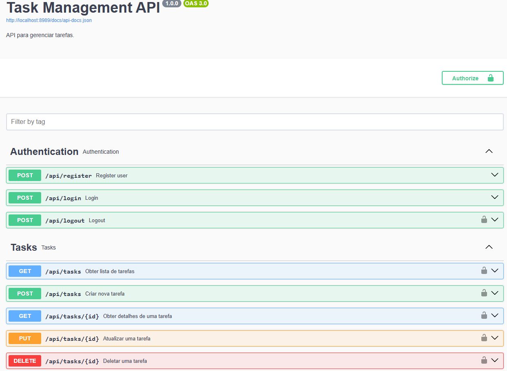

10. Faça o registro de um usuário
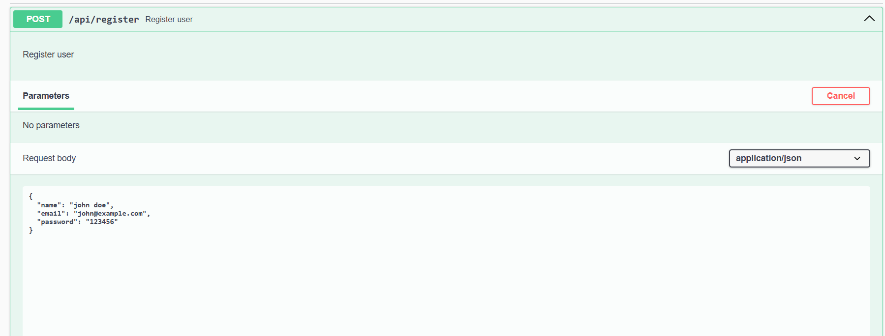

11. Faça o login com o usuário criado
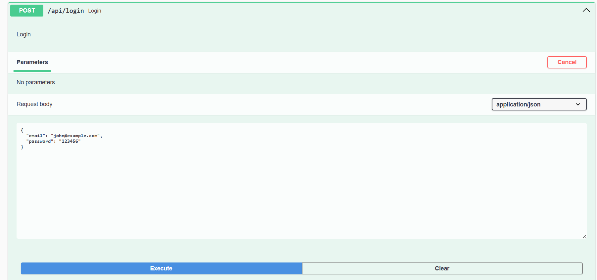

12. Recupere o `token` de autenticação
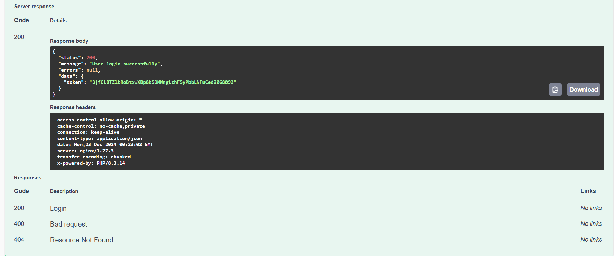

13. Vá em `authorize`, cole o `token` e clique em `authorize`

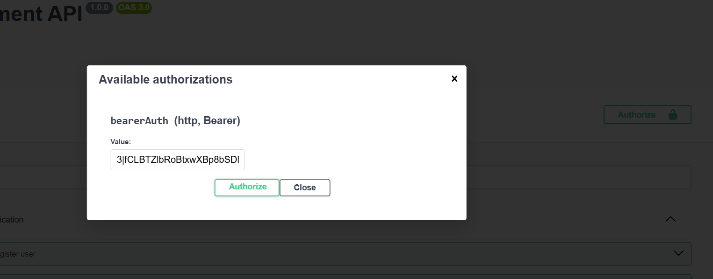

14. Agora, você pode acessar as rotas protegidas (`/api/tasks`)

15. Listando tarefas de forma paginada
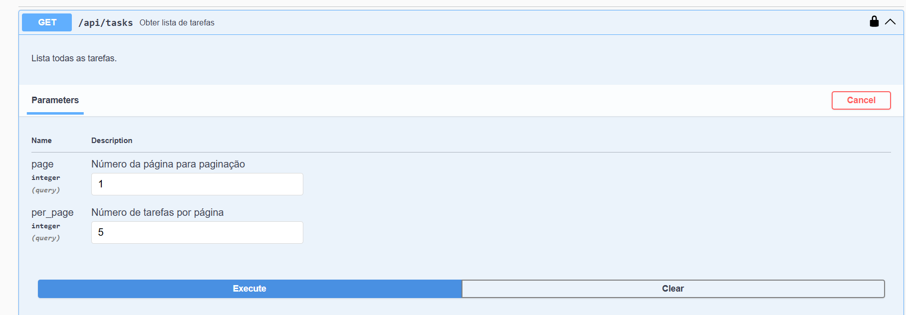
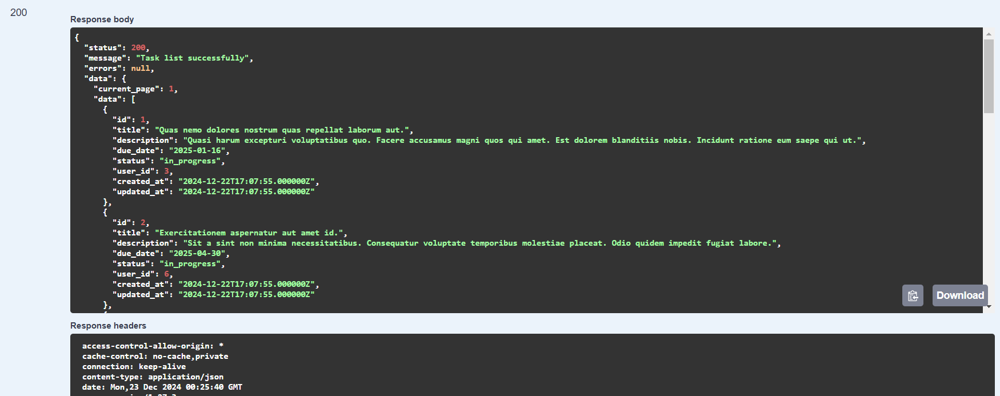
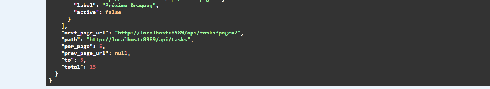

16. Criando uma nova tarefa
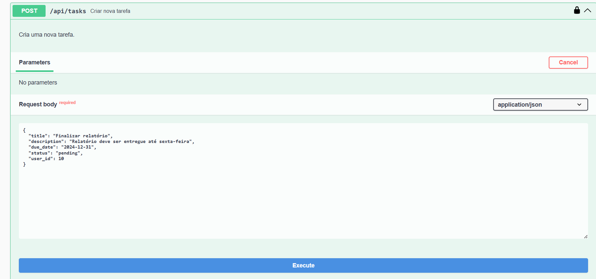
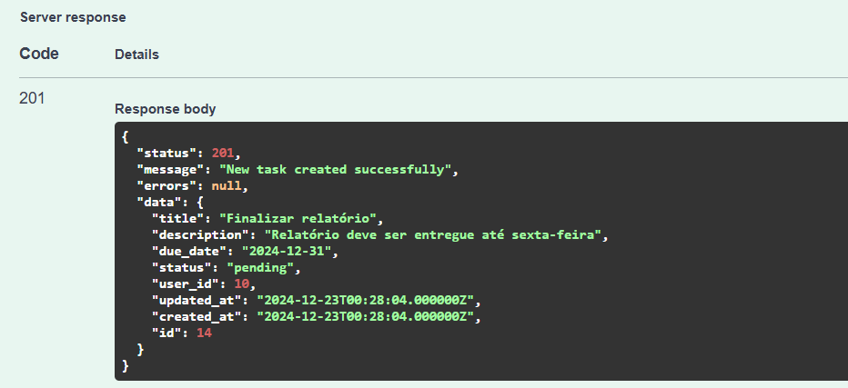

17. Recuperando a tarefa recém criada
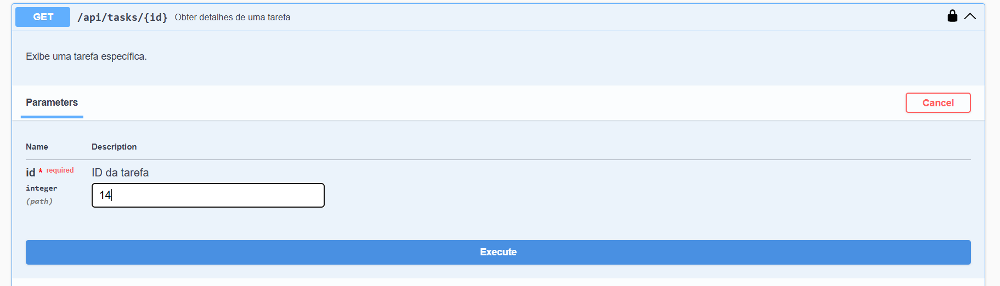
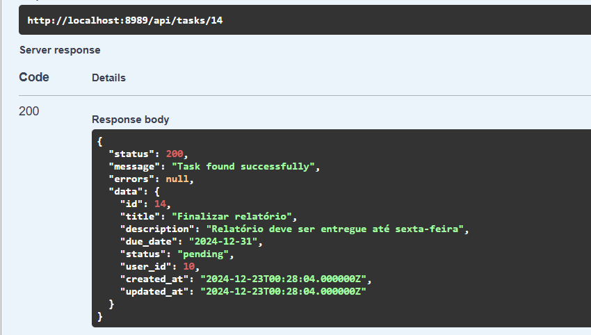

18. Tentando atualizar a tarefa de forma errada
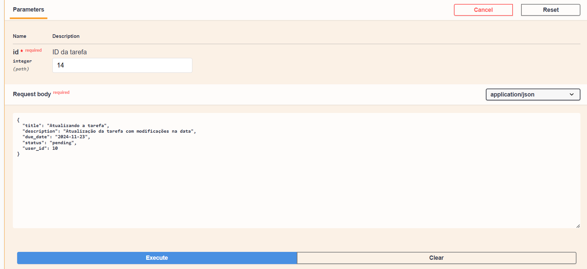 
Repare que a data de vencimento deve ser uma data igual a hoje ou futura. A nossa aplicação tem validação para todos os campos e com tradução. 
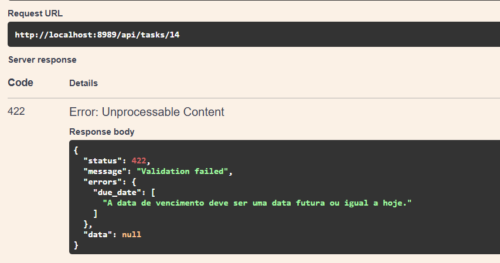

19. Atualizando a tarefa com sucesso
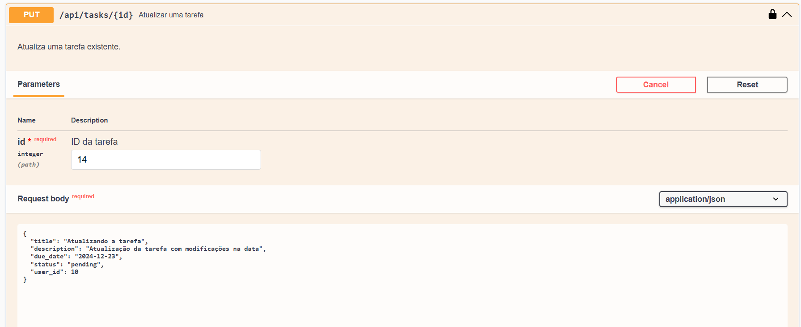
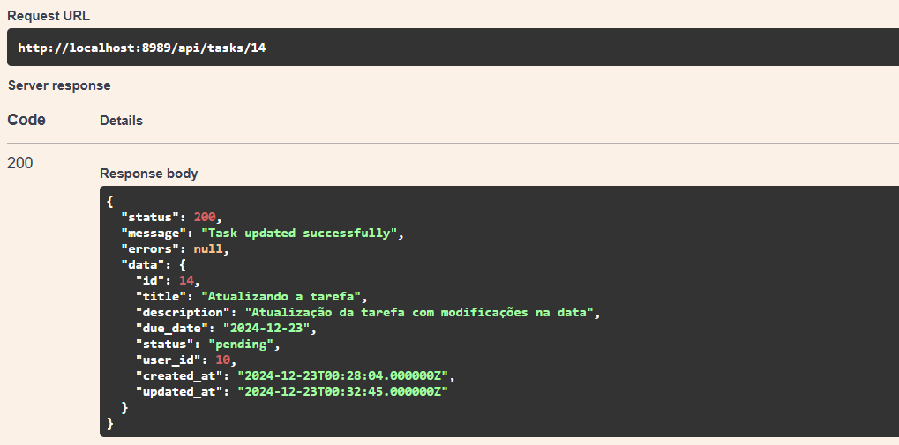

20. Deletando a tarefa 
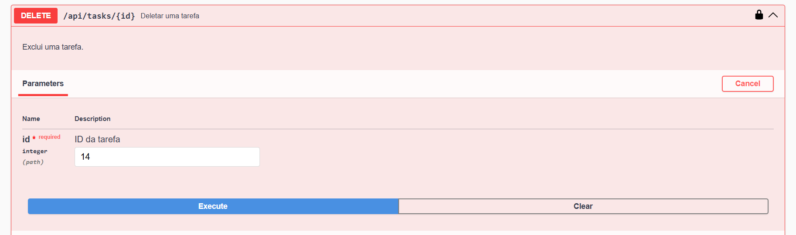
Ao final obtemos sucesso com o status code 204.
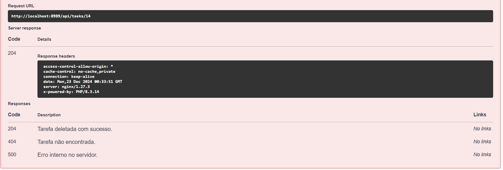 

Só o criador da tarefa pode deletar a tarefa.
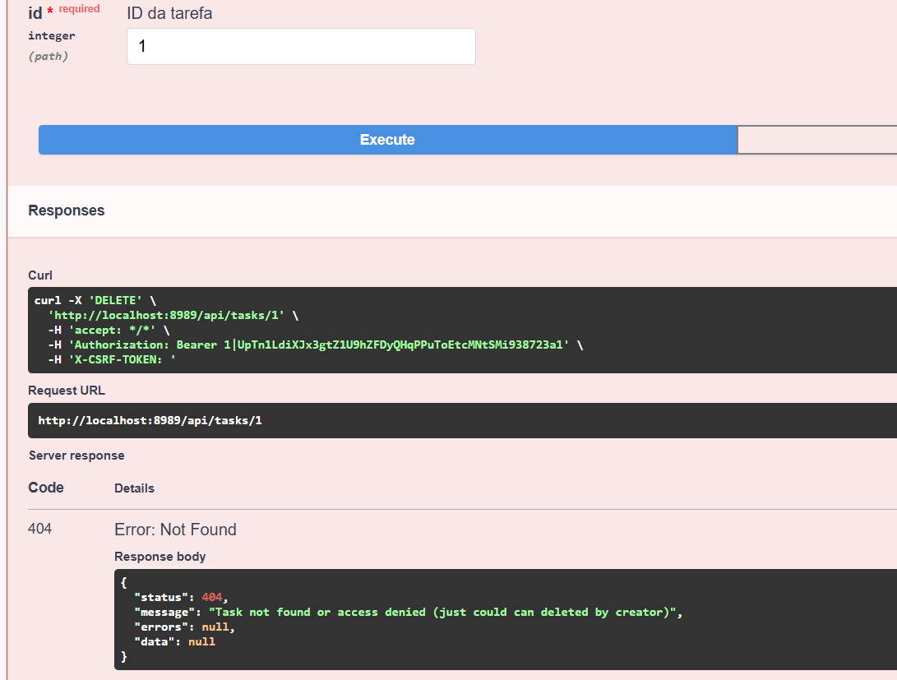

## OBS: A nossa aplicação tem validação para todos os campos e com tradução. 

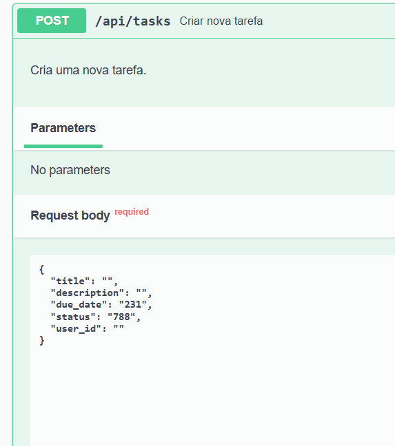
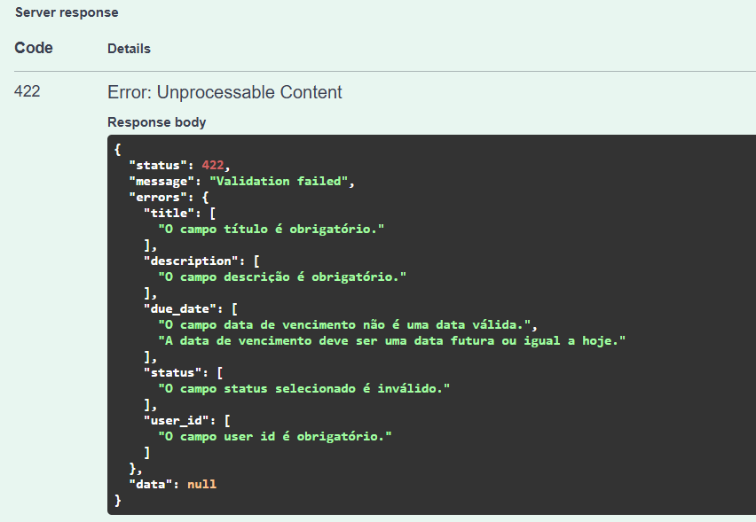

21. Tentando cadastrar um usuário com e-mail duplicado
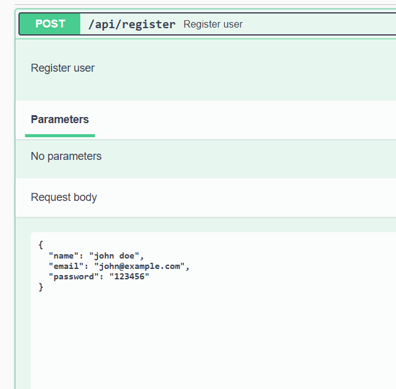
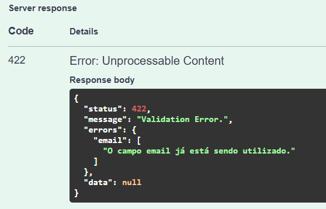

### Outra forma de testar a aplicação é rodando os testes
```bash
php artisan test
```